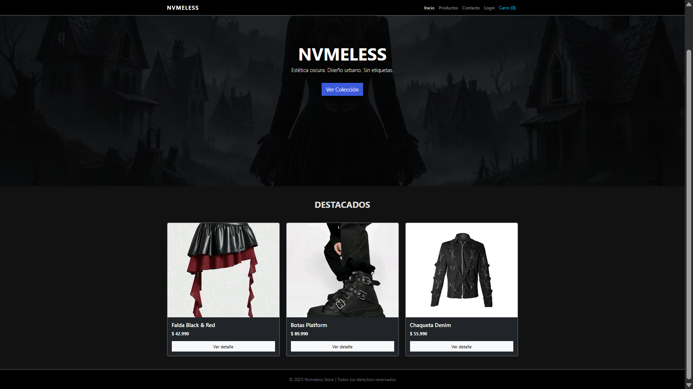
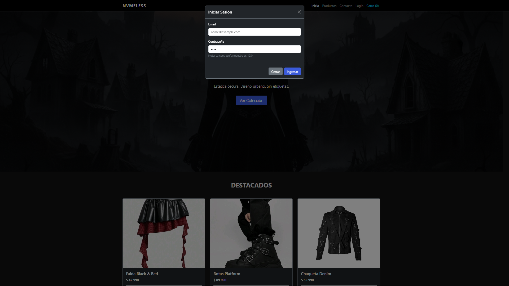
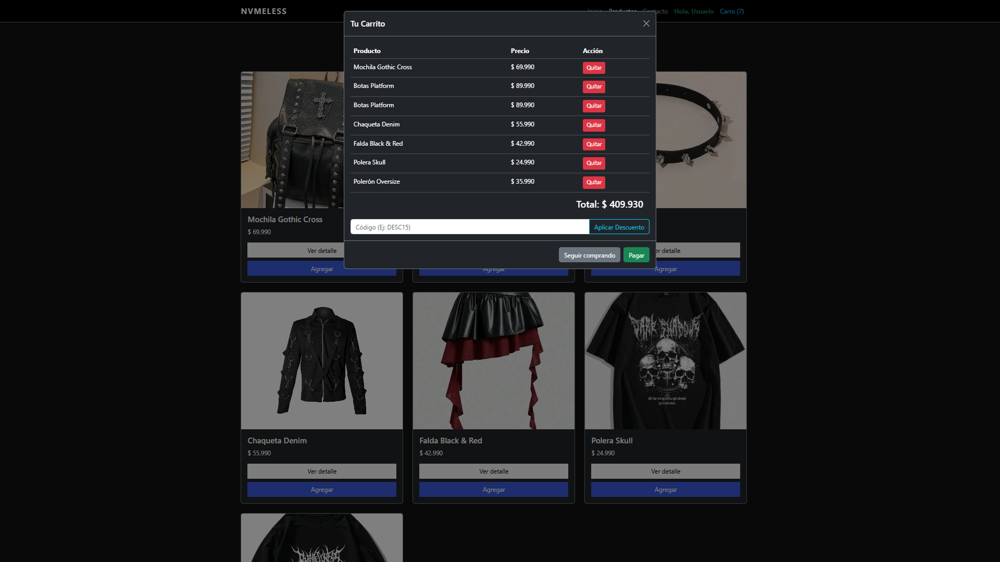

# 🌑 Nvmeless Store | E-commerce Prototype

> **Proyecto Académico Evolutivo: Desarrollo Full Stack JavaScript Trainee**
> Integración de Fundamentos Front-End (Módulo 2) y Lógica de Programación JavaScript (Módulo 3).

## 📖 Visión General del Proyecto

**Nvmeless Store** es un prototipo funcional de un e-commerce enfocado en moda urbana con estética _Dark/Goth_.

El proyecto comenzó como una maqueta estática responsiva para validar habilidades de diseño y estructura (HTML5/CSS3/Bootstrap). Posteriormente, **se refactorizó el código base** para implementar lógica de negocio del lado del cliente mediante **JavaScript (ES6+)**, dotando al sitio de interactividad real, gestión de estado (carrito de compras) y simulación de flujos de usuario (autenticación).

---

## 🚀 Evolución Técnica

### 🔹 Fase 1: Maquetación y Diseño (Módulo 2)

El objetivo inicial fue construir una interfaz sólida, accesible y visualmente atractiva sin depender de lógica compleja.

- **HTML5 Semántico:** Estructura optimizada para SEO y mantenibilidad.
- **Bootstrap 5.3:** Implementación de Grid System para diseño _Responsive_, componentes UI (Cards, Navbar) y utilidades de espaciado.
- **CSS3 Custom:** Personalización del tema visual (Dark Mode) y efectos de transición (`assets/css/styles.css`).

### 🔹 Fase 2: Lógica y Manipulación del DOM (Módulo 3)

Se implementó una arquitectura basada en eventos para transformar el sitio en una aplicación dinámica.

- **Controlador Central (`app.js`):** Centralización de la lógica de negocio.
- **Estructuras de Datos:** Manejo de Arreglos de Objetos para el `catálogo` y el `carrito`.
- **Manipulación del DOM:** Renderizado dinámico de la tabla del carrito y actualización de contadores en tiempo real.
- **Características Implementadas:**
  - ✅ **Carrito de Compras:** Agregar/Quitar productos y cálculo de subtotales.
  - ✅ **Lógica de Descuentos:** Validación de cupones (Ej: `DESC15`).
  - ✅ **Autenticación (Mock):** Sistema de Login simulado con validación de credenciales.
  - ✅ **Interfaz Interactiva:** Uso de Modales de Bootstrap controlados vía JavaScript API.

---

## 📸 Capturas de Pantalla

### Vista Home



### Vista Login



### Vista Carrito



---

## 📂 Arquitectura del Proyecto

La estructura de directorios sigue las buenas prácticas de separación de responsabilidades (SoC), manteniendo los activos estáticos separados de la lógica y las vistas.

```text
nvmeless-store/
├── assets/
│   ├── css/
│   │   └── styles.css          # Estilos personalizados y sobreescritura de Bootstrap
│   └── img/
│       ├── accesorio-goth.jpeg
│       ├── botas-platform.jpeg
│       ├── chaqueta-denim.jpg
│       ├── falda-goth.jpeg
│       ├── hero-banner.png
│       ├── mochila-gothic.jpg
│       ├── polera-skull.jpg
│       └── poleron-oversize.jpeg
├── index.html                  # Landing Page (Home)
├── productos.html              # Vista de Catálogo General
├── producto-accesorio.html     # Detalle de Producto
├── producto-botas.html
├── producto-chaqueta.html
├── producto-falda.html
├── producto-mochila.html
├── producto-polera.html
├── producto-poleron.html
├── app.js                      # Core Logic (Carrito, Auth, DOM)
└── README.md                   # Documentación del Proyecto
```
---

## 🛠 Tecnologías Utilizadas
- **HTML5 Semántico:** Estructura clara y accesible.
- **CSS3:** Estilos personalizados (`assets/css/styles.css`), uso de `object-fit` para control de imágenes y diseño visual oscuro.
- **Bootstrap 5.3 (CDN):** Sistema de grillas (Grid), Navbar responsive, Cards y componentes de utilidad.
- **Git / GitHub:** Control de versiones y flujo de trabajo.
- **JavaScript (ES6):**	Lógica del cliente, manipulación de Arrays y DOM.

---

## 🧪 Instrucciones de Pruebas (QA)
Para validar las funcionalidades implementadas en la fase 3, siga los siguientes pasos:

1. Autenticación (Login)
Haga clic en el enlace "Login" en la barra de navegación.

Ingrese cualquier correo electrónico.

Ingrese la Contraseña Maestra: 1234.

Resultado esperado: Alerta de bienvenida y cambio de estado en el Navbar.

2. Flujo de Compra
Navegue por el catálogo o las fichas de producto.

Haga clic en "Agregar" o "Agregar al carro".

Resultado esperado: El contador del menú "Carro (n)" se incrementa.

3. Gestión del Carrito y Descuentos
Haga clic en "Carro (n)" para abrir el modal.

Verifique que los productos seleccionados aparecen en la tabla.

Ingrese el código promocional: DESC15.

Resultado esperado: Se aplica un 15% de descuento sobre el total y se actualiza el monto a pagar.

---

## 🚀 Cómo visualizar el proyecto
Clona o descarga este repositorio (https://github.com/Lfiedlerf/M3_nvmeless_ecommerce)
Asegúrate de tener conexión a internet (necesaria para cargar Bootstrap vía CDN).
Abre el archivo index.html en tu navegador web de preferencia.
Recomendación: Para una mejor experiencia, utiliza la extensión Live Server de Visual Studio Code.

👤 Autor
Luis Fiedler - Desarrollador Fullstack en formación